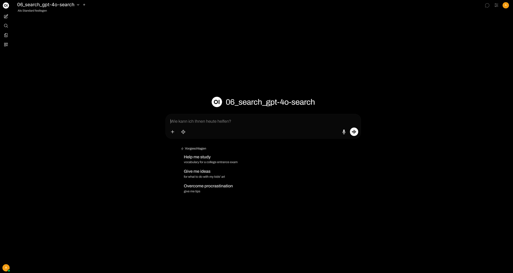
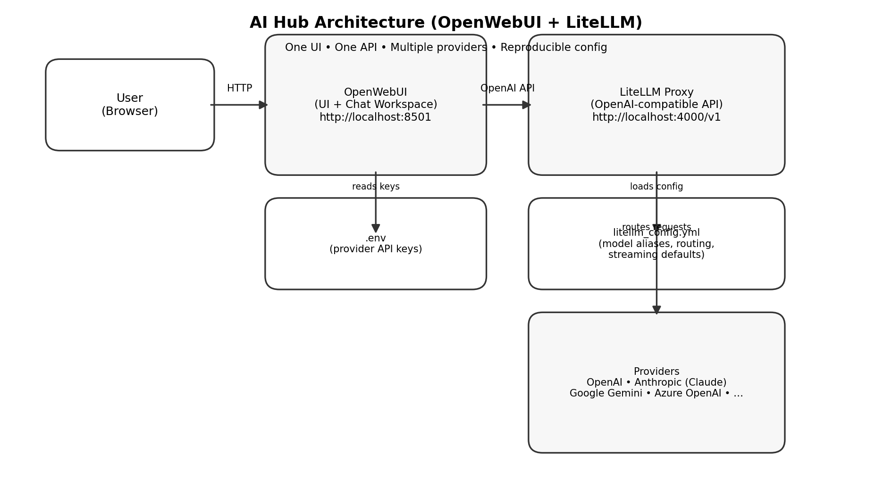
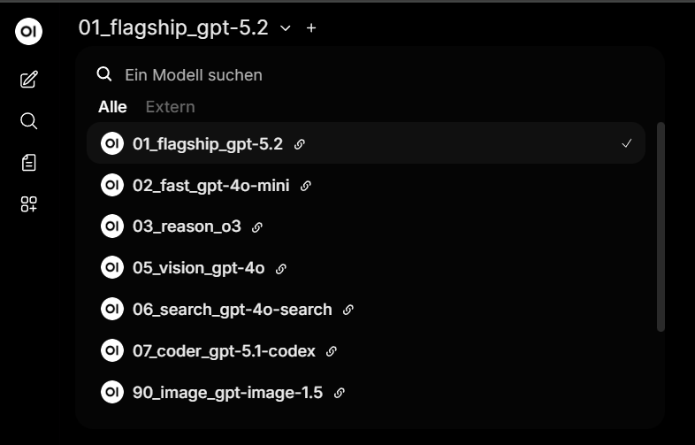
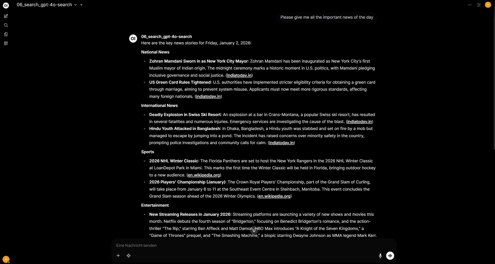

# AI Hub (LiteLLM + OpenWebUI)
A lightweight, open-source, provider-agnostic AI hub for running and comparing a curated model portfolio behind a single API endpoint.



## Why this exists
Most teams don’t fail because models are bad — they fail because access, routing, and operational guardrails are messy:
- Different providers, inconsistent model names, unclear defaults
- Ad-hoc “best model” decisions without fallbacks
- Works on one laptop, breaks on another after an update
- Chat works, but embeddings / moderation / image gen behave differently

This AI Hub solves that by putting **LiteLLM** in front of everything as the single source of truth, and **OpenWebUI** as the human-friendly interface.

## What you get
### Curated model portfolio (clear labels)
I’ve put together a **pragmatic, well-rounded default portfolio** that covers the most common day-to-day needs (quality, speed, reasoning, vision, search) with **stable, intentionally sorted aliases**:
- **01_flagship_gpt-5.2** – best overall quality  
- **02_fast_gpt-4o-mini** – fast/cheap default for daily use  
- **03_reason_o3** – deliberate reasoning  
- **05_vision_gpt-4o** – multimodal / image understanding  
- **06_search_gpt-4o-search** – web/search model (streaming off by choice)  
- Optional: **coder**, **long-context**, **image generation**, **embeddings**, **moderation**

This set is meant as a **strong baseline**, not a fixed list. You can easily **extend, swap, or update models** over time (new providers, new versions, new capabilities) by updating the LiteLLM configuration—without changing the UI or downstream clients.

### Provider-agnostic by design
LiteLLM makes the stack **provider-independent** by routing requests through an OpenAI-compatible API.  
That means you can plug in **multiple providers side by side**—for example **OpenAI, Anthropic (Claude), Google Gemini**, and others—and expose them under **one unified model portfolio** in the same OpenWebUI interface by adding API keys in the config.

Switching or adding providers doesn’t require changes in the UI or downstream clients—**it’s just configuration** (model aliases + provider credentials).

### Operational mindset built-in
- Stable aliases (no brittle “model version string” in the UI)
- Streaming defaults tuned per model type (e.g., reasoning/search can be non-stream)
- Reproducible “pinned mode” using image digests

---
## Architecture (high level)
- **OpenWebUI** (UI) → talks to →
- **LiteLLM Proxy** (routing / config / single API) → talks to →
- **LLM providers** (OpenAI today, others can be configured)


## Screenshots / Proof
### Sorted model portfolio in OpenWebUI




---
## Quick start (local)
> Requirements: Docker Desktop

1) Create a local `.env` from the template:
```bash
cp .env.example .env
# set OPENAI_API_KEY=...
```
2) Start the stack:
```bash
docker compose up -d
```
OpenWebUI: http://localhost:8501
LiteLLM: http://localhost:4000/v1


### Stable/ reproducible (recommended for sharing)
This repo supports a pinned mode using image digests.
Run pinned:
```bash
docker compose -f docker-compose.yml -f docker-compose.pinned.yml up -d


